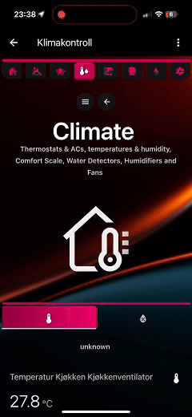

# Presenting the SMARTi Integration for Home Assistant  
## How Home Assistant dashboards should be!

  

 

- Do you find it challenging to create a comprehensive dashboard that **meets the needs** of everyone in your household?  
 

- Are you **frustrated** with having to update your dashboard every time you add or remove a device to Home Assistant?  
 

- Do you wish your dashboard could feature a **sleek, professional, and clean design**?  
 

- Are you looking for a **single dashboard solution** that works seamlessly across all your devices—phones, tablets, and desktops? 
 

- Do you want a higher wife-aproval rating for your Home Assistant setup?
 

If the answer is **YES** to any one of the questions above, then **SMARTi** is the integration for you!

 
 

SMARTi delivers a complete, hassle-free maintenance experience with a seamless and intuitive dashboard for Home Assistant. By harnessing the full potential of Home Assistant, SMARTi automatically gathers all your devices into a single, auto-populated dashboard—designed for multiple devices and available in multiple languages.

### With SMARTi, you only need **one** dashboard to meet the needs of your entire household, across **all devices**.

From beautiful animations to advanced power monitoring and control, SMARTi is designed to simplify Home Assistant, offering a more user-friendly experience for everyone in your home.

  

# Dashboard Snippets
  <!-- Homepage Section -->
  

    
    
    
    
  

  <br<>
  <!-- Themes Section -->

 # Themes 
  

    
    
Do you want to change the look and feel to make the dashboard more personalized? SMARTi includes 5 pre-installed themes to choose from.

  

View more examples of the dashboards at the end of the readme.

# Versions

## SMARTi Versions

SMARTi is available in two versions:

### FREE: SMARTi Basic
SMARTi Basic is completely free to download and use. It provides essential features for managing your Home Assistant setup without requiring a subscription.

### PAID: SMARTi Pro (requires a monthly subscription) at 2.99 EUR/Month
SMARTi Pro unlocks advanced features and enhanced functionality, ideal for power users seeking to maximize the potential of their smart home setup. A subscription is required and can be purchased at:
https://www.smarti.dev/smarti-store/p/smarti-powerflow-xe7ft

# Note

SMARTi does not modify any existing files in your Home Assistant installation! Everything will remain as is after an installation. If the integration is removed, it will automatically remove all its configuration files, but not touch any of your existing ones.

# SMARTi Feature Basic vs Pro Comparison

| Category                  | SMARTi Basic - Free                                                                                          | SMARTi Pro - 2.99 EUR/month                                                                                  |
|---------------------------|-------------------------------------------------------------------------------------------------------------|--------------------------------------------------------------------------------------------------------------|
| **Dashboard**             | **Auto-Populated**                                                                                         | **Auto-Populated**                                                                                         |
|                           | _Description:_ Provides fully automated, dynamic dashboards for a seamless experience.                     | _Description:_ Provides fully automated, dynamic dashboards for a seamless experience.                       |
| **Dashboard Device Support** | **Desktops, Tablets**                                                                                     | **Desktops, Tablets, Phones**                                                                                |
|                           | _Description:_ Optimized for use on desktop computers and tablets.                                         | _Description:_ Fully compatible with desktops, tablets, and mobile phones.                                   |
| **Automations**           | **None**                                                                                                   | **Water Leak Alert, Fire Alert, Smoke Alert, Gas Alert, Main Fuse Overload Alert**                           |
|                           | _Description:_ No automation options are included in the free version.                                     | _Description:_ Includes pre-configured automations for common safety alerts (can be disabled).               |
| **Customizations**        | **None**                                                                                                   | **Customization**                                                                                             |
|                           | _Description:_ No customization options for dashboard layout or content.                                   | _Description:_ Coming Soon: Allows some control over dashboard layout and content.                                        |
| **Language**              | **English**                                                                                                | **English, French, German, Spanish, Norwegian, Dutch**                                                      |
|                           | _Description:_ Only English is available in the free version.                                              | _Description:_ Offers support for multiple languages for a global audience.                                  |
| **Power Control**         | **None**                                                                                                   | **PowerFlow - Coming Soon**                                                                                  |
|                           | _Description:_ Basic tools for monitoring energy usage.                                                    | _Description:_ Coming soon - Advanced tools for energy monitoring and management.                            |
| **Kiosk Mode**            | **Not Supported**                                                                                          | **Enabled**                                                                                                  |
|                           | _Description:_ Kiosk Mode is not available in the free version.                                            | _Description:_ Provides advanced Kiosk Mode, including dynamic header/sidebar visibility and media queries.  |
| **Token Lifetime**        | **Indefinitely**                                                                                                | **Continuous (Active Subscription + Remaining Days)**                                                        |
|                           | _Description:_ Tokens are valid indefinitely.     | _Description:_ Tokens remain valid as long as the subscription is active, with additional remaining days.    |
| **Feature Updates**       | **Yearly**                                                                                                 | **Monthly**                                                                                                  |
|                           | _Description:_ Features are updated only once per year.                                                   | _Description:_ Features are updated every month with new capabilities.                                       |
| **Updates**               | **Quarterly**                                                                                              | **Continuous**                                                                                               |
|                           | _Description:_ Non-breaking bugs are addressed roughly every three months in the free version.             | _Description:_ Bugs are fixed on an ongoing basis for faster resolutions.                                    |

Q: Why is there a monthly subscription cost for the Pro version?
 

A: In order to fully dedicate to an environment that is constantly changing and to provide useful updates to the SMARTi dashboard and its automations, a monthly cost is needed to properly develop, run, test and deploy the solution.

# Installation

Prerequisties:

* ## This integration only supports Home Assistant 2024.8 and above. Installing and configuring this integration on a Home Assistant installation with a lower version than this will result in errors and the integration will not work properly.

Before starting your installation, make sure you have the two following lines in you configuration.yaml file:
<pre>
homeassistant:
  packages: !include_dir_named packages 
</pre>

# Installation via HACS
Prerequisites

Ensure you have HACS installed and running in your Home Assistant instance.
Steps to Install

1. ## Add the SMARTi Repository
    - Open HACS in Home Assistant.
    - Go to Settings > Custom Repositories.
    - Add the repository URL:
    - https://github.com/Prosono/SMARTi_BaseComponent
    - Set the category to Integration and click Add.

2. ## Install SMARTi
    - Search for SMARTi in HACS.
    - Click Install.
    - Restart Home Assistant after the installation is complete.

3. ## Add the Integration
    - Navigate to Settings > Devices & Services > Add Integration in Home Assistant.
    - Search for SMARTi and select it.

4. ## Select Your SMARTi Version
    - Choose between SMARTi Basic or SMARTi Pro during setup.

5. ## Token and Email Requirements
    - SMARTi Basic: A token is automatically generated and sent to your email if you select "I do not have a token."
    - SMARTi Pro: A token must be purchased from our website:
    - Purchase SMARTi Pro Token
    - Upon successful payment, the token will be sent to your email.

6. ## Enter Your Token and Email
    - After selecting your SMARTi version, enter your token and email to proceed.

7. ## Choose Your Installation Mode
    - Automatic Installation:
    - Installs all required resources and switches Home Assistant to YAML mode.
    - Manual Installation:
    - Requires manual installation and configuration of resources. Refer to the Required Cards section below for details.

- ### Manual

If you select manual mode during the setup of the SMARTi integration, none of the required cards will be automatically downloaded from HACS. Instead, it will be the responsibility of the end user to install these cards manually, either by directly downloading them or by using HACS.

A complete list of the cards required for the SMARTi integration can be found in the "Required Cards" section at the end of this README. Please ensure that all listed cards are properly installed to fully utilize the SMARTi dashboard and its features.

- ### Automatic

If you select automatic mode during the setup of the SMARTi integration, it will automatically enable YAML mode for your Home Assistant installation and download all the cards required for the SMARTi dashboard.

Please note that enabling YAML mode changes the way resources are managed in your Home Assistant setup. By default, Home Assistant operates in storage mode, but with YAML mode enabled, any additional cards you download from HACS (or existing cards not included with the SMARTi integration) will not be active in your installation. **Also if you already have yaml mode enabled in Home Assistant somwhere in your configuration, you must select the manual mode!**

For a list of cards included with the SMARTi integration, refer to the "Included Cards" section at the bottom of the README. Be sure to follow this process for any extra cards you wish to use to ensure proper functionality.

This also means that the SMARTi integration takes full responsibility for managing the provided cards, including updating, adding, and removing them as needed.

For the best experience, we recommend using the automatic installation during the initial setup of the SMARTi integration to ensure everything is installed and configured correctly. If you encounter conflicts with pre-existing dashboards that use cards not provided by the SMARTi integration, you can uninstall and re-install the integration in manual mode to maintain compatibility with your custom setup.

## When uninstalling the integration ALL settings, files, dashboards, automations etc related to the SMARTi integration will be deleted and your installation will return to its original state. 

# Usage

So you have successfully installed the SMARTi dashboard! Congratulations!
 

You might notice that some text is quite dark and unreadable (if you are using the basic Home Assistant theme)

To change this, we will have to do the following:

1. I am used to changing my themes and I have several already installed:
You simply go into your personal Home Assistant settigns and change your theme to one of the SMARTi themes. There are several versions included. Select the dark mode option. 

2. I have never used themes before

In your configuration.yaml file, add the following lines to the top of the configuration.yaml:

<pre>
frontend:
  themes: !include_dir_merge_named themes
</pre>

Restart your Home Asssitant installation and then you simply go into your pesonal Home Assistant settings and change your theme to one of the SMARTi themes. There are several versions included. Select the dark mode option.

## How the dashboard works
SMARTi uses device locations (Areas) and the device domain (Light, switch, humidifier etc) to correctly populate your dashboard. 

## My devices are not showing
The SMARTi dashboard is dependant on correct placement of your devices (areas) and type of equipment. If you do not find that your devices are listed in the proper locations, please verify that the devices exists under the "Unassigned Entities" section under the Misc tab and that they are given the correct domain in Home Assistant.

Also, an entity cannot contain an "'" in its name, Like "Linda's Light", it must be named "Lindas Light" instead. 

## Have SMARTi **NOT** show devices/entities
If you prefer SMARTi to exclude certain entities from appearing on its dashboards, simply hide those entities in your Home Assistant settings. Once hidden, SMARTi will automatically exclude them from display, ensuring a more tailored and clutter-free experience. Make sure to refresh the page once an entity has been hidden in order to see the reflected changes. 

## Set up power measurement sensor
Since SMARTi uses a more general power sensor, this will have to be set. This can be set under the settings page under "Dynamic Power Sensor". If no sensors are present here, click the button "Update Power Sensor List" And it will populate the list with all sensors having a power measurement and you can select the proper one for the correct power measurement.

## No Weather forecast in the dashboard 
The weather forecast is dependent on a sensor called "home" (forecast_home). If you do not have this entity, create one from the met.no integration under "Devices and Services" and simply name it "Home".

## There is no calendar!
The Calendar section is also dependant on a calendar simply named "calendar". If you don't have one, create a new calendar called "calendar".

## Go from Basic to Pro

If you have the Basic version installed and you have upgraded to the pro version, uninstall the smarti integration and re-install it selecting the "pro" version.

# Dependencies:

The SMARTi integration does not require any additional integrations to function. However, to unlock its full potential and access advanced features, it is recommended to install the following integrations:

- ## Browser Mod
 
The Browser Mod integration enhances the functionality of SMARTi by enabling certain popups to operate as designed. Additionally, it plays a key role in monitoring and displaying active devices directly within the SMARTi navigation bar, providing a seamless and interactive user experience. While not mandatory, this integration is highly recommended for full feature compatibility.

- ## Alarmo
 
The Alarmo integration enables users to set up a customizable and feature-rich alarm system within Home Assistant. Fully integrated into the SMARTi ecosystem, Alarmo is a required component for the proper functionality of SMARTi’s alarm panels and alert systems. This seamless integration ensures that your security features are optimized and operate as intended, providing a reliable and user-friendly alarm solution.

- ## Ping (ICMP)
 
By adding a ping sensor named "smarti_internet" in the Home Assistant UI, you can monitor your internet connection with detailed statistics. Additionally, this sensor provides a convenient status icon in the navigation bar, allowing you to quickly view the state of your connection at a glance.

## Required Cards (cards that must be installed manually if selecting the manual mode):

- Alarmo Card
- ApexCharts Card
- Bar Card
- Bubble Card
- Button Card
- Button Text Card
- Clock Weather Card
- Comfortable Environment Card
- Config Template Card
- HA Sankey Chart
- Logbook Card
- Lottie Card
- Auto Entities
- Card Mod
- Card Templater
- Card Tools
- Kiosk Mode
- Home Feed Card
- Hourly Weather Card
- Hui Element
- Layout Card
- Mushroom Card
- Mini Graph Card
- Numberbox Card
- Slider Button Card
- Stack-in-Card
- Tabbed Card
- Time Bar Card
- Uptime Card
- Vertical Stack-in-Card
- Weather Chart Card
- Better Moment Card
- Maxi Media Player
- Swipe Card

# Disclaimer

This integration enhances your Home Assistant setup by adding multiple automations, sensors, entities, and helpers. All components are prefixed with "SMARTi_xxx" to ensure easy filtering and to prevent conflicts with any existing items in your installation. Rest assured, the integration is designed to seamlessly coexist with your current setup. However, if this naming convention is a concern for you, the SMARTi integration may not be the right fit.

# License

This repository is licensed under the MIT license, granting you the freedom to fork, copy, modify, and redistribute its contents as you see fit. However, please note that the configuration files downloaded to your Home Assistant installation are not covered under the same license. Upon installation, the applicable licenses for these configuration files are placed in the "smartilicenses" folder for your reference.

# Support, bugs and reporting

If you encounter any non-breaking bugs, please open an issue in the GitHub repository.
For any immediate issues, bugs, issues, or feedback, please contact our support team at support@smarti.dev. We value your input and strive to continuously improve our products and services.

# More Examples

  <!-- Weather Section -->
  

    
    
  

   
  <!-- Themes Section -->
  

    
    
  

   

   

    
    
  

   

