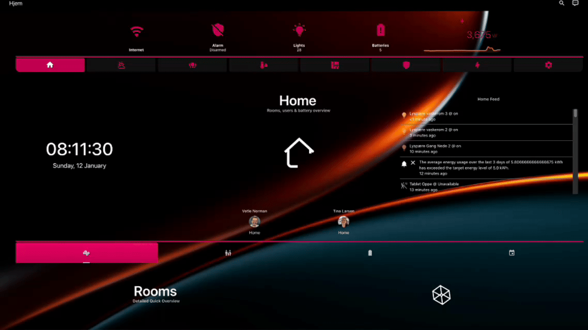
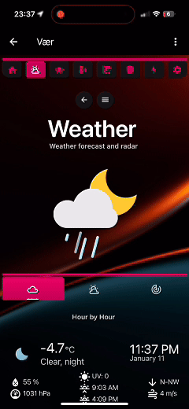
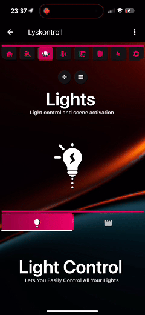

# Presenting the SMARTi Integration for Home Assistant  
## How Home Assistant dashboards should be!

  

 

- Do you find it challenging to create a comprehensive dashboard that **meets the needs** of everyone in your household?  
 

- Are you **frustrated** with having to update your dashboard every time you add or remove a device to Home Assistant?  
 

- Do you wish your dashboard could feature a **sleek, professional, and clean design**?  
 

- Are you looking for a **single dashboard solution** that works seamlessly across all your devices—phones, tablets, and desktops? 
 

- Do you want a higher wife-aproval rating for your Home Assistant setup?
 

If the answer is **YES** to any one of the questions above, then **SMARTi** is the integration for you!

 
 

SMARTi delivers a complete, hassle-free maintenance experience with a seamless and intuitive dashboard for Home Assistant. By harnessing the full potential of Home Assistant, SMARTi automatically gathers all your devices into a single, auto-populated dashboard—designed for multiple devices and available in multiple languages.

### With SMARTi, you only need **one** dashboard to meet the needs of your entire household, across **all devices**.

From beautiful animations to advanced power monitoring and control, SMARTi is designed to simplify Home Assistant, offering a more user-friendly experience for everyone in your home.

  <!-- Homepage Section -->
  

    
    
  

  <br<>>
  <!-- Themes Section -->
  

    
    
Do you want to change the look and feel to make the dashboard more personalized? SMARTi includes 5 pre-installed themes to choose from.

  

  

    
    
  

   

  

    
    

  

   

  

    
    

  

   

  

    
    
Do you want to change the look and feel to make the dashboard more personalized? SMARTi includes 5 pre-instaleld themes to choose from.

  

# Versions

SMARTi Comes in a **FREE** (SMARTi Basic) verison and a **PAID** version (SMARTi PRO) which has a monthly subscription cost.

SMARTi Basic does not require a subscription to be downloaded and installed, but the Pro version does. A subrsctiption can be purchased at https://smarti.dev

The table below highlights the feature of the SMARTi dashboard and the differences between the Basic and Pro version:
# SMARTi Feature Basic vs Pro Comparison

| Category                  | SMARTi Basic - Free                                                                                          | SMARTi Pro - 2.99 EUR/month                                                                                  |
|---------------------------|-------------------------------------------------------------------------------------------------------------|--------------------------------------------------------------------------------------------------------------|
| **Dashboard**             | **Auto-Populated**                                                                                         | **Auto-Populated**                                                                                           |
|                           | _Description:_ Automatically generates dashboards with basic information.                                  | _Description:_ Provides fully automated, dynamic dashboards for a seamless experience.                       |
| **Dashboard Device Support** | **Desktops, Tablets**                                                                                     | **Desktops, Tablets, Phones**                                                                                |
|                           | _Description:_ Optimized for use on desktop computers and tablets.                                         | _Description:_ Fully compatible with desktops, tablets, and mobile phones.                                   |
| **Automations**           | **None**                                                                                                   | **Water Leak Alert, Fire Alert, Smoke Alert, Gas Alert**                                                     |
|                           | _Description:_ No automation options are included in the free version.                                     | _Description:_ Includes pre-configured automations for common safety alerts.                                 |
| **Customizations**        | **None**                                                                                                   | **Full Customization**                                                                                       |
|                           | _Description:_ No customization options for dashboard layout or content.                                   | _Description:_ Allows some control over dashboard layout and content.                                    |
| **Language**              | **English**                                                                                                | **English, French, German, Spanish, Norwegian, Dutch**                                                      |
|                           | _Description:_ Only English is available in the free version.                                              | _Description:_ Offers support for multiple languages for a global audience.                                  |
| **Power Control**         | **None**                                                                                                   | **PowerFlow**                                                                                                |
|                           | _Description:_ Basic tools for monitoring or managing energy usage.                                           | _Description:_ Coming soon - Advanced tools for energy monitoring and management.                                 |
| **Themes**                | **Single Theme**                                                                                           | **Multiple Themes**                                                                                          |
|                           | _Description:_ Only one default theme is available.                                                       | _Description:_ Offers five distinct themes for visual customization.                                         |
| **Feature Updates**       | **Yearly**                                                                                                 | **Monthly**                                                                                                  |
|                           | _Description:_ Features are updated only once per year.                                                   | _Description:_ Features are updated every month with new capabilities.                                       |
| **Updates**               | **Quarterly**                                                                                              | **Continuous**                                                                                               |
|                           | _Description:_ Non-breaking bugs are addressed roughly every three months in the free version.                                  | _Description:_ Bugs are fixed on an ongoing basis for faster resolutions.                                    |

Q: Why is there a monthly subscription cost for the Pro verison?
 
A: In order to fully dedicate to an enviroment that is constantly changing and to provide usefull updates to the SMARTi dashboard and its automations, a monthly cost is needed to properly develop, run, test and deploy the solution.

# Installation

Installation

Pre-requisties:

* ## This integration only supports Home Assistant 2024.8 and above. Installing and configuring this integration on a Home Assistant installation with a lower version than this will result in errors and the integration will not work properly.

Before starting you installation, make sure you have the two following lines in you configuration.yaml file:
<pre>
homeassistant:
    packages: !include_dir_named packages 
</pre>

Via HACS

Ensure you have HACS installed in your Home Assistant instance.
Add this repository as a custom repository:
   - Open HACS in Home Assistant.
   - Go to Settings > Custom Repositories.
   - Add the repository URL: https://github.com/Prosono/SMARTi_BaseComponent
   - Set the category to Integration and click Add.
   - Search for SMARTi in HACS and click Install.
   - Restart Home Assistant.
   - Go to Settings > Devices & Services > Add Integration in Home Assistant.
Search for SMARTi and select it.
   - You now have to select the SMARTi Basic or the SMARTi Pro option.
   - After that you now have the following two choices:

A SMARTi Basic token is generated and sent to you by email upon initial configuration when selecting "I do not have a token" and is valid for 30 days, this will have to be renewd manually after the token expires by setting up the integfration again. 

A SMARTi Pro token must be pruchased forom our website at https://www.smarti.dev/smarti-store/p/smarti-powerflow-xe7ft

After you have selected your SMARTi version and you have sucessfully entered your token and email, you will have the two following installation options:

- ### Manual

If selecting manual mode when setting up the integration, SMARTi will NOT download any of the required cards from HACS. This will have to be done manually by the end user manually or via HACS. The cards required by the SMARTi integration is listed below at the end of this readme.

- ### Automatic

If selecting automatic mode when setting up the integraiton, SMARTi will enable .yaml mode for your Home Assistant installation and download all the cards required by the SMARTi dashboard. This also means that your Home Assistant instalaltion will now be in .yaml mode ( it is set to storage mode by default) meaning that if you are to download more cards from HACS (or have other cards from HACS installed that is not included in the SMARTi integration - again, check the included cards at the bottom of the readme), you will have to add theese manually to your configuration.yaml file after installing from HACS. 

#### Example:
Lets say that you want to download another custom card not included with the SMARTi integration - e.g the "lovelace-dual-gauge-card" you will then have to add the following line to your configuration.yaml:

<pre>
lovelace:
mode: yaml
resources: 
    url: /community_plugin/dual-gauge-card/dual-gauge-card.js 
    type: js  
</pre>

What this also means is that the SMARTi integration is now repsonsible for maintining the supplied cards and keeping them updated, adding/removing them etc. 

We reccomend that you do the automatic installation for the initial installation of the SMARTi integration to verify that everything works as it should. You can always uninstall the integration and then re-install it in manual mode if some of your pre-existing dashboard are using cards that the SMARTi integration is not providing. 

## When uninstalling the integration ALL settings, files, dashboards, automations etc related to the SMARTi integration is deleted and your installation will return to its original state. 

# Usage

## Have SMARTi **NOT** show devices/entities
If you want SMARTi to NOT show entities in the dashboards, simply hide them in Home Assistant and SMARTi will no longer display them.

## Set up power measurement sensor
Since SMARTi uses a more general power sensor, this will have to be set. This can be set under the settings page under "Dynamic Power Sensor". IKf no sensors are present here, just click the button "Update power Sensor Lsit" ANd it will populate with all sensors haveing a power measurement and you can select the proper one. 

# Dependencies:

The SMARTi integration does not reqire any integrations to function, but for the full potential usage, it is reccomended to install the following integrations:

- ## Browser Mod
 
This integration will allow for some popups to function as designed, but it is mainly used for looking into the active devices showing in the SMARTi navigation bar

- ## Alarmo
 
This integration will allow the user to set up their own alarm system and Alarmo is fully integrated into SMARTi and is required for the alarm panels and alerts to function as designed. 

- ## Ping (ICMP)
 
Adding a ping sensor in the ui caled "smarti_internet" will also provide you with statistics of your internet connection as well as a status icon in the navbar

If you encounter any issues, please open an issue in the GitHub repository.

Let me know if you want to customize specific sections or add additional details!

## Required Cards (cards that must be installed manually if selecting the manual mode):

- Alarmo Card
- ApexCharts Card
- Bar Card
- Bubble Card
- Button Card
- Button Text Card
- Clock Weather Card
- Comfortable Environment Card
- Config Template Card
- HA Sankey Chart
- Logbook Card
- Lottie Card
- Auto Entities
- Card Mod
- Card Templater
- Card Tools
- Home Feed Card
- Hourly Weather Card
- Hui Element
- Layout Card
- Mushroom Card
- Mini Graph Card
- Numberbox Card
- Slider Button Card
- Stack-in-Card
- Tabbed Card
- Time Bar Card
- Uptime Card
- Vertical Stack-in-Card
- Weather Chart Card
- Better Moment Card
- Maxi Media Player
- Swipe Card

# Disclaimer

This integration adds multiple automations, sensors, entities and helpers to your Home Assistant installation. They are all named "SMARTi_xxx" for easy filtering and not to conflict with existing helpers, entities, automations etc you might already have present and will not affect your current installation. Please do note that if you are bothered by this, then the SMARTi integration is not for you. 

# License

This repo is licensed under the MIT licenese, meaning you can do whatever you want with it, fork it, copy it, modify it, re-distribute it etc, the configuration files it donwloads to your Home Assistant instalaltion is NOT licensed under the same license. After instalaltion, the necessary licenes are placed within the "smartiliceneses" folder

# Support, bugs and reporting

Please report bugs, issues and other things at support@smarti.dev