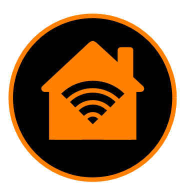
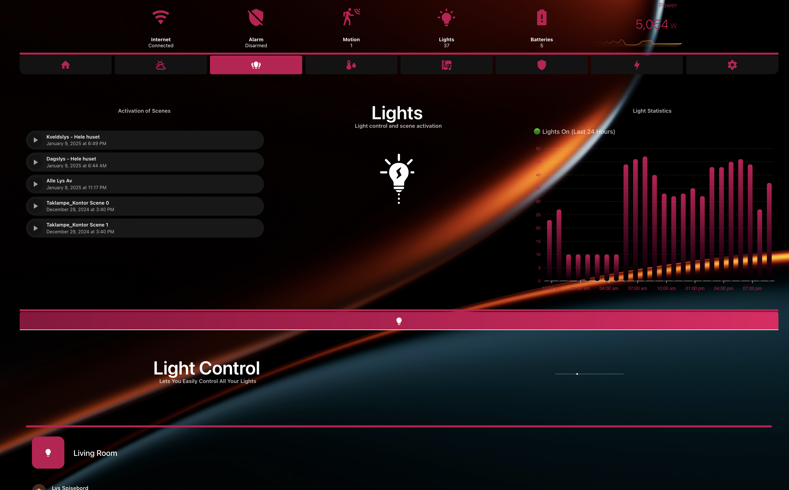

# Presenting the SMARTi Integration for Home Assistant  
## How Home Assistant dashboards should be!

  

 

  

- Do you find it challenging to create a comprehensive dashboard that **meets the needs** of everyone in your household?  

 

- Are you **frustrated** with having to update your dashboard every time you add a new device to Home Assistant?  
 

- Do you wish your dashboard could feature a **sleek, professional, and clean design**?  
 

- Are you looking for a **single dashboard solution** that works seamlessly across all your devices—phones, tablets, and desktops? 
 

- Are you tired of having to update all your custom cards from HACS manually?

  

If the answer is yes to any one of the questions above, SMARTi is the integration for you!

SMARTi delivers a complete, hassle-free maintenance experience with a seamless and intuitive dashboard for Home Assistant. By harnessing the full potential of Home Assistant, SMARTi automatically gathers all your devices into a single, auto-populated dashboard—designed for multiple devices and available in multiple languages.

##That’s right! With SMARTi, you only need one dashboard to meet the needs of your entire household, across all devices.

From beautiful animations to advanced power monitoring and control, SMARTi is designed to simplify Home Assistant, offering a more user-friendly experience for everyone in your home.

# Versions

SMARTi Comes in a **FREE** (SMARTi Basic) verison and a **PAID** version (SMARTi PRO) which has a monthly subscription cost

The table below highlights the feature of the SMARTi dashboard and thje differences between the Basic and Pro version:
# SMARTi Feature Comparison

| Category                  | SMARTi Basic - Free                                                                                          | SMARTi Pro - 2.99 EUR/month                                                                                  |
|---------------------------|-------------------------------------------------------------------------------------------------------------|--------------------------------------------------------------------------------------------------------------|
| **Dashboard**             | **Auto-Populated**                                                                                         | **Auto-Populated**                                                                                           |
|                           | _Description:_ Automatically generates dashboards with basic information.                                  | _Description:_ Provides fully automated, dynamic dashboards for a seamless experience.                       |
| **Dashboard Device Support** | **Desktops, Tablets**                                                                                     | **Desktops, Tablets, Phones**                                                                                |
|                           | _Description:_ Optimized for use on desktop computers and tablets.                                         | _Description:_ Fully compatible with desktops, tablets, and mobile phones.                                   |
| **Automations**           | **None**                                                                                                   | **Water Leak Alert, Fire Alert, Smoke Alert, Gas Alert**                                                     |
|                           | _Description:_ No automation options are included in the free version.                                     | _Description:_ Includes pre-configured automations for common safety alerts.                                 |
| **Customizations**        | **None**                                                                                                   | **Full Customization**                                                                                       |
|                           | _Description:_ No customization options for dashboard layout or content.                                   | _Description:_ Allows some control over dashboard layout and content.                                    |
| **Language**              | **English**                                                                                                | **English, French, German, Spanish, Norwegian, Dutch**                                                      |
|                           | _Description:_ Only English is available in the free version.                                              | _Description:_ Offers support for multiple languages for a global audience.                                  |
| **Power Control**         | **None**                                                                                                   | **PowerFlow**                                                                                                |
|                           | _Description:_ No tools for monitoring or managing energy usage.                                           | _Description:_ Includes advanced tools for energy monitoring and management.                                 |
| **Themes**                | **Single Theme**                                                                                           | **Multiple Themes**                                                                                          |
|                           | _Description:_ Only one default theme is available.                                                       | _Description:_ Offers five distinct themes for visual customization.                                         |
| **Feature Updates**       | **Yearly**                                                                                                 | **Monthly**                                                                                                  |
|                           | _Description:_ Features are updated only once per year.                                                   | _Description:_ Features are updated every month with new capabilities.                                       |
| **Updates**               | **Quarterly**                                                                                              | **Continuous**                                                                                               |
|                           | _Description:_ Bugs are addressed every three months in the free version.                                  | _Description:_ Bugs are fixed on an ongoing basis for faster resolutions.                                    |

Q: Why is there a monthly subscription cost for the PRO verison?
A: In order to fully dedicate to an enviroment that is constantly changing and to provide usefull updates to the usabviliusability ty of the SMARTi dashboard and its automations, a monthly cost is needed to run the developemnt.

# Installation

Installation

Pre-requisties:

* This integration only supports Home Assistant 2024.8 and above. Installing and configuring this integration on a Home Assistant installation with a lower version than this will result in errors and the integration will not work properly.

Before starting you installation, make sure you have the two following lines in you configuration.yaml file:
<pre> homeassistant:
        packages: !include_dir_named packages  </pre>

Via HACS

Ensure you have HACS installed in your Home Assistant instance.
Add this repository as a custom repository:
   - Open HACS in Home Assistant.
   - Go to Settings > Custom Repositories.
   - Add the repository URL: https://github.com/Prosono/SMARTi_BaseComponent
   - Set the category to Integration and click Add.
   - Search for SMARTi in HACS and click Install.
   - Restart Home Assistant.
   - Go to Settings > Devices & Services > Add Integration in Home Assistant.
Search for SMARTi and select it.
   - You now have to select the SMARTi Basic or the SMARTi Pro option.
   - After that you now hae the following two choices:

### Manual

If selecting manual mode when setting up the integration, SMARTi will NOT download any of the required cards from HACS. This will have to be done manually by the end user. The cards required by the SMARTi integration is listed below

### Automatic

If selecting automatic mode when setting up the integraiton, SMARTi will enable .yaml mode for you Home Assistant installation and download all the cards required by the SMARTi dashboard. The also means that your Home Assistant isntalltion will now be in .yaml mode meaning that if you are to download more cards from HACS (or have other cards form HACS installed that is not included in the SMARTi integration), you will have to add theese manually to your configuration.yaml file after installing form HACS. 

#### Example:
Lets say that you want to download another custom card not included with the SMARTi integration - e.g the "lovelace-dual-gauge-card" you will then have to add the following line to your configuration.yaml:

<pre> url: /community_plugin/dual-gauge-card/dual-gauge-card.js 
      type: js  </pre>

What thsi also means is that the SMARTi integration is now repsonsible for maintining theese cards and keeping them updated, adding/removing them etc. 

# Dependencies:

The SMARTi integration does not reqire any integrations to function, but for the full potential usage, it is reccomended to install the following integrations:

- Browser Mod
This integration will allow for some popups to function as designed, but it is mainly used for looking into the active devices showing in the SMARTi navigation bar

- Alarmo
This integration will allow the user to set up their own alarm system and Alarmo is fully integrated into SMARTi and is required for the alarm panels and alerts to function as designed. 

- Ping (ICMP)
Adding a ping sensor in the ui caled "smarti_internet" will also provide you with statistics of your internet connection as well as a status icon in the navbar

If you encounter any issues, please open an issue in the GitHub repository.

Let me know if you want to customize specific sections or add additional details!

## Required Cards:

- Alarmo Card
- ApexCharts Card
- Bar Card
- Bubble Card
- Button Card
- Button Text Card
- Clock Weather Card
- Comfortable Environment Card
- Config Template Card
- HA Sankey Chart
- Logbook Card
- Lottie Card
- Auto Entities
- Card Mod
- Card Templater
- Card Tools
- Home Feed Card
- Hourly Weather Card
- Hui Element
- Layout Card
- Mushroom Card
- Mini Graph Card
- Numberbox Card
- Slider Button Card
- Stack-in-Card
- Tabbed Card
- Time Bar Card
- Uptime Card
- Vertical Stack-in-Card
- Weather Chart Card
- Better Moment Card
- Maxi Media Player
- Swipe Card

# Disclaimer

This integration adds multiple automations, sensors, entities and helpers to your Home Assistant installation. They are all named "SMARTi_xxx" for easy filtering and not to conflict with existing helpers, entities, automations etc you might already have present and will not affect your current installation. Please do note that if you are bothered by this, then the SMARTi integrtion is not for you. 